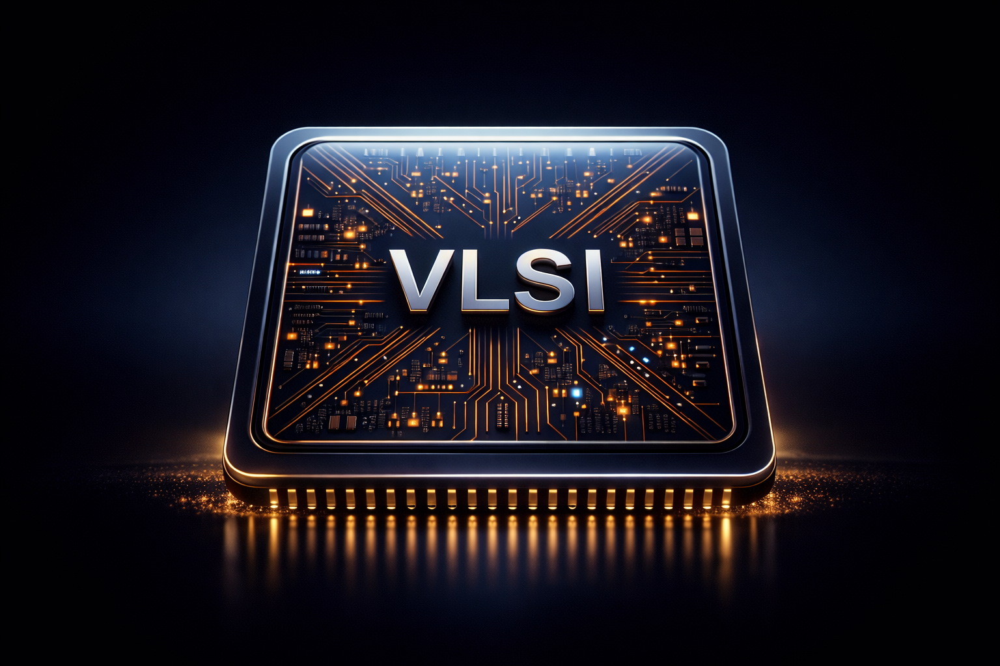

<h1 align="center">
     
    
     
    Very Large Scale Integration (VLSI) Design
     
</h1>

> [!WARNING]
> This repository is unfinished. Keep your expectations low.

## Requirements

- [GHDL](https://github.com/ghdl/ghdl) for VHDL simulation.
- [Icarus Verilog](https://github.com/steveicarus/iverilog) for Verilog simulation.
- [Surfer](https://github.com/samitbasu/surfer-project-rhdl) for waveform visualization.
